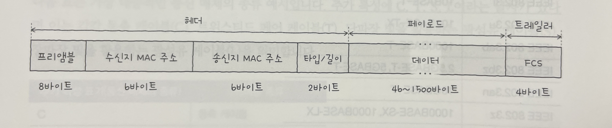

## 2-1 (이더넷)

- 물리 계층과 데이터 링크 계층을 구성하는 네트워크 기술
- 유선 LAN 환경에서 가장 대중적으로 사용하는 기술
- 통신 매체의 규격, 송수신되는 프레임의 형태, 프레임을 주고받는 방법등이 정의된 네트워크 기술임

### 이더넷 표준

- 오늘날의 유선 LAN 환경에서, 물리 계층은 이더넷 규격 케이블을 사용하고, 데이터 링크 계층에서 주고받는 프레임은 이더넷 프레임을 사용하는 것이 일반적
- 오늘날의 물리 계층과 데이터 링크 계층을 구성하는 네트워크 장비들은 특정 이더넷 표준을 이해하고 따른다.
  - 예시) 허브, 스위치, NIC, 케이블 등
- 많은 표준들이 만들어지고 있음
  - 핵심은 이더넷 표준에 따라 지원되는 네트워크 장비, 통신매체의 종류와 전송 속도 등이 달라질 수 있다는 점
- 이더넷이 처음 등장한 후 IEEE에서 이더넷 표준을 IEEE 802.3으로 정의했고, 802.3u, 802.3ab, 802.3z 등 다양한 표준이 존재

### 통신 매체 표기 형태 (물리 계층)

- 이더넷 표준에 따라 통신 매체의 종류와 전송 속도가 달라지기 때문에, 통신 매체 표기 형태가 있어야함
- 통신 매체 표기 형태는 `전송 속도BASE-추가 특성`으로 표기
  - 예시) 1000BASE-SX, 1000BASE-LX, 10BASE-T, 2.5GBASE-T 등
- 전송 속도, BASE, 추가 특성
  - 전속 속도
    - 숫자만 표기 : Mbps
    - 숫자 뒤에 G : Gbps
    - 예시) 100BASE-T 케이블 - 100Mbps 속도의 케이블, 10GBASE-T 케이블 - 10Gbps 속도의 케이블
  - BASE
    - Baseband의 약자로, 변조 타입을 의미
    - 변조 타입이란?
      - 비트 신호로 변환된 데이터를 통신 매체로 전송하는 방법
    - 변조 타입 종류 -> ????
      - BASE : 디지털 신호를 송수신하는 방식 (BASEband)
      - BROAD : 아날로그 신호를 송수신하는 방식 (BROADband)
      - PASS : 전송 매체를 통해 여러 신호를 동시에 전송하는 방식 (PASSband)
    - 일반적인 LAN 환경에서는 디지털 신호를 송수신하는 Baseband 방식을 사용하므로, 대부분의 이더넷 통신 매체는 BASE를 사용한다고 생각하면 됨
  - 추가 특성
    - 통신 매체의 특성을 명시
    - 특성 종류
      - 전송 가능한 최대 거리
        - 예시) 10BASE-2, 10BASE-5
      - 물리 계층 인코딩 방식 -> ????
        - 예시) 1000BASE-C**X**, 1000BASE-T**X** ...
      - 레인 수 (비트 신호를 옮길 수 있는 전송로 수) -> ????
        - 예시) 100GBASE-LR**4**, 100GBASE-SR**4** ...

### 통신 매체 종류

- 추가 특성에 C, T, S, L가 등장하는데, 이는 통신 매체의 종류를 나타냄
  - C : 동축 케이블 -> 동축 케이블이 뭔지?
  - T : 트위스티드 페어 케이블 -> 2-2에서 설명
  - S : 단파장 빛을 활용하는 광섬유 케이블 -> 2-2에서 설명
  - L : 장파장 빛을 활용하는 광섬유 케이블 -> 2-2에서 설명

### 이더넷 프레임 (데이터 링크 계층)

- 유선 LAN 환경은 대부분 이더넷 기반으로 구성되어 있음
- 이더넷 표준이 있기 때문에, 호스트가 데이터 링크 계층에서 주고받는 이더넷 프레임 형식은 정해져 있음
- 이더넷 프레임은 헤더 + 페이로드 + 트레일러로 구성

  - 헤더 : 프리앰블, 수신지 MAC 주소, 송신지 MAC 주소, 타입/길이로 구성
  - 페이로드 : 실제로 전송되는 데이터
  - 트레일러 : FCS (Frame Check Sequence)로 구성 -> 오류 검출을 위한 부분
    

#### 프리앰블

- 이더넷 프레임의 첫 부분으로, 이더넷 프레임이 전송되기 전에 수신 호스트에게 이더넷 프레임이 전송되고 있다는 것을 알리는 역할
- 즉, 송수신지 간의 동기화를 위해 사용되는 정보

#### 수신지 MAC 주소와 송신지 MAC주소

- MAC 주소는 네트워크 인터페이스마다 부여되는 6바이트 길이의 주소로, LAN내의 수신지와 송신지를 특정할 수 있다.
- 같은 네트워크 내 기기들의 MAC 주소가 같으면 송수신지를 특정하기 어렵기 때문에, 일반적으로 고유하고 변하지 않는 값을 가짐.
  - MAC 주소가 변경 가능한 경우도 있어서 고유하지 않은 경우도 존재함. 하지만 동일 네트워크 내에서 MAC 주소가 같을 확률은 매우 낮음. -> MAC 주소를 같게 만드는 상황이 있을까?
- 보통 NIC(Network Interface Card)라는 장치가 네트워크 인터페이스 역할을 수행
  - NIC가 MAC 주소를 가짐 -> 기기내에 NIC가 여러 개 있을 수 있으면 MAC 주소도 여러 개 존재
- 맥주소 확인 방법
  - 윈도우 : ipconfig /all
  - 리눅스, MAC OS : ifconfig
- MAC 주소는 총 48비트 16진수로 표현되며, 2자리씩 콜론(:)으로 구분
  - 예시) 00:1A:2B:3C:4D:5E

#### 타입/길이

- 타입/길이 필드에는 타입 혹은 길이가 올 수 있음
- 필드에 명시된 크기에 따라 타입 혹은 길이를 나타냄
  - 1500(05DC) 이하일 경우
    - 프레임의 크기(길이)를 나타냄
  - 1536(0600) 이상일 경우
    - 이더넷 프레임의 타입을 나타냄 -> 이더타입이라고도 부름
    - 상위 계층에서 사용된 프로토콜 이름이 명시됨
    - 예시) 0800 : IPv4, 86DD : IPv6, 0806 : ARP

#### 데이터

- 데이터는 상위 계층에서 전달 받거나, 상위 계층으로 전달할 내용을 의미
- 네트워크 계층의 데이터와 헤더를 합친 PDU가 이곳에 포함됨
- 46바이트 이상, 1500바이트 이하의 크기를 가짐
- 46바이트 이하일 경우, 패딩을 추가하여 46바이트 이상의 크기를 가지게 됨

#### FCS

- 이더넷 프레임에 오류가 있는지 확인하기 위한 필드
- CRC(Cyclic Redundancy Check), 즉 순환 중복 검사라고 불리는 오류 검출용 값이 들어감.
- 송신 호스트에서 이더넷 프레임을 생성할 때, 프리앰블을 제외한 나머지 값을 바탕으로 CRC 값을 계산하여 FCS 필드에 넣음
- 수신 호스트에서도 FCS 값을 계산하여 송신 호스트가 계산한 FCS 값과 비교
  - 값이 일치하지 않으면 오류가 있는 것으로 판단하고, 프레임을 폐기

### 토큰 링

- 이더넷 외에 다른 LAN 기술으로 토큰 링이 있음
- 호스트들이 링 형태로 연결되며, 토큰이라는 신호가 순서대로 호스트들을 돌아다니면서 통신 권한을 주는 방식
- 즉, 토큰이 있어야 메시지 전송 가능.

## 2-2 (NIC와 케이블)

### NIC (Network Interface Card)

- 호스트를 네트워크에 연결하기 위한 하드웨어
- MAC 주소를 가지고 있음
- 역할
  - 호스트와 유무선 통신 매체를 연결
  - 신호를 프레임으로 변환 : 수신지
  - 프레임을 신호로 변환 : 송신지
  - 자기 주소와 수신지 주소를 인식함
    - 자신과 관련없는 수신지 MAC 주소를 가진 프레임은 폐기
    - FCS 필드를 통해 오류 검출해서, 오류가 있는 프레임은 폐기

### 트위스티드 페어 케이블

- 구리선으로 전기 신호를 주고받는 통신 매체
- 본체와 커넥터로 이루어짐
- 랜선의 헤드부분이 커넥터, 케이블이 본체
- 본체 내부는 구리 선이 두 가닥씩 꼬아져 있음
- 구리 선은 전자적 간섭이 생길 수 있는데, 이를 노이즈라 함
- 노이즈를 최소화 하기 위해, 브레이드 실드나 포일 실드를 케이블 주위에 감는다
  - 브레이드 실드 : 그물 모양의 철사
  - 포일 실드 : 알루미늄 호일

#### 실드에 따른 트위스티드 페어 케이블의 종류

- STP(Shielded Twisted Pair)
  - 브레이드 실드를 사용한 케이블
- FTP(Foiled Twisted Pair)
  - 포일 실드를 사용한 케이블
- UTP(Unshielded Twisted Pair)
  - 실드가 없는 케이블
- 실드의 종류에 따른 케이블 명칭 표기 예시
  - **XX**/**Y**TP
    - **XX** : 케이블 외부를 감싸는 실드의 종류
    - **Y** : 꼬인 구리 선 쌍을 감싸는 실드의 종류
  - 예시) S/FTP, F/FTP, SF/FTP, U/UTP

#### 카테고리에 따른 트위스티드 페어 케이블의 종류

- 카테고리는 케이블의 성능의 등급을 구분하는 역할을 함
- 카테고리는 Cat으로 표기함
  - 예시) Cat3, Cat5 ...
- 카테고리가 높을수록 케이블의 성능이 높음
  - 성능이 높다는 것은 지원 가능한 대역폭이 높아짐
    - 이는, 더 빠른 속도로 더 많은 양의 데이터를 전송할 수 있다는 것을 의미

### 광섬유 케이블

- 빛을 통신 신호로 사용하는 통신 매체
- 전기 신호를 이용하는 케이블에 비해, 빠르고 먼 거리까지 전송이 가능
- 따라서, 대륙 간 네트워크 연결에도 사용됨
- 커넥터와 본체로 이루어짐
  - 트위스트 페어 케이블에 비해 커넥터 종류가 다양
    - 예시) LC, SC, FC, ST
  - 본체 내부는 광섬유로 구성되어 있음
  - 광섬유
    - 빛을 운반하는 매체
    - 코어 : 빛이 통과하는 중심 부분
    - 클래딩 : 빛이 코어에서만 흐르도록 가둠
  - 광섬유는 코어의 지름에 따라 분류함
    - 싱글 모드 광섬유 케이블
    - 멀티 모드 광섬유 케이블

#### 싱글 모드 광섬유 케이블

- 코어의 지름이 8~10um 정도로 작음
- 코어의 지름이 작아서, 빛의 이동경로가 하나 이상을 갖기 어렵고, 이를 '모드가 하나'라고 표현
- 신호 손실이 적기 때문에, 장거리 전송에 적합 (수십km까지 가능)
- 비용이 높다는 단점이 있음
- 파장이 긴 장파장의 빛을 사용

#### 멀티 모드 광섬유 케이블

- 코어의 지름이 50~62.5um 정도로 싱글 모드보다 큼
- 코어의 지름이 크기 때문에, 빛의 이동경로가 여러 개가 될 수 있고, 이를 '모드가 여러 개'라고 표현
- 신호 손실이 크기 때문에, 단거리 전송에 적합 (수백미터, 길어야 수 킬로미터 정도)
- 단파장의 빛을 ㅏㅅ용

## 2-3 (허브)

### 주소 개념이 없는 물리 계층

- 물리 계층
  - 주소 개념이 없음
  - 호스트와 통신 매체 간의 연결과 통신 매체상의 송수신이 이루어질 뿐
  - 송수신되는 정보에 대한 어떠한 조작이나 판단을 하지 않음
- 데이터 계층
  - 주소 개념이 있음
  - 송수신지를 특정할 수 있음
  - 주소를 바탕으로 송수신되는 정보에 대한 조작과 판단이 가능
- 이 차이점은 물리 계층과 데이터 계층의 장비와 기술, 특징을 이해하는 기반이 됨 (허브와 스위치의 차이점을 이해하는데 중요)

### 허브

- 대표적인 물리 계층 네트워크 장비
- 여러 대의 호스트를 연결하는 장치
- 커넥터를 연결할 수 있는 포트가 존재

#### 특징 (2가지)

- 전달받은 신호를 다른 모든 포트로 그대로 다시 내보냄
  - 신호를 전달받으면, 어떠한 조작이나 판단을 하지 않고 송신지를 제외한 모든 포트에 그저 내보내기만 함.
  - 신호를 받은 호스트는 데이터 링크 계층에서 패킷의 MAC주소를 확인하고 자신과 관련 없는 주소는 폐기함.
- 반이중 모드로 통신 (<-> 전이중 통신)
  - 동시에 송수신하지 않고, 송신과 수신을 번갈아가며 수행하는 통신 방법 (1차선 도로)

#### 콜리전 도메인

- 콜리전
  - 두 개 이상의 호스트가 동시에 데이터를 송신할 때 발생하는 현상
- 콜리전 도메인
  - 콜리전이 발생할 수 있는 범위.
  - 허브의 경우, 허브에 연결된 모든 호스트가 하나의 콜리전 도메인에 속함.
  - 콜리전 도메인으로 인한 충돌 문제를 해결하려면 CSMA/CD 프로토콜을 사용하거나 스위치를 사용해야함.

#### 허브 정리

- 허브란, 여러대 호스트를 연결하는 물리 계층 장비. 전다받은 신호를 다른 모든 포트로 그대로 내보내고, 반이중 모드로 통신함. 허브에 연결된 모든 호스트는 하나의 콜리전 도메인에 속하며, 콜리전 도메인의 범위가 클수록 충돌이 발생할 가능성 높아짐.

### CSMA/CD

- 허브에서 충돌이 발생하는 이유는, 허브가 반이중 모드로 통신하기 때문임
- CSMA/CD는 반이중 이더넷 네트워크에서 충돌을 방지하는 대표적인 프로토콜이다.

#### CSMA/CD의 동작

- CS는 Carrier Sense의 약자로, 캐리어 감지를 의미
  - 메시지를 보내기 전, 현재 네트워크상에서 전송 중이 것이 있는지 확인
- MA는 Multiple Access의 약자로, 다중 접근을 의미
  - 캐리어 감지에도 불구하고, 여러 호스트가 동시에 데이터를 송신할 수 있는데, 이를 다중 접근이라고 함
- CD는 Collision Detection의 약자로, 충돌 검출을 의미
  - 충돌이 발생하면, 충돌을 감지
  - 충돌을 감지하면, 전송이 중단되고
  - 충돌을 검출한 호스트는 다른 이들에게 충돌이 발생했음을 알림 by 잼 신호
  - 이후, 일정 시간 동안 대기한 후, 다시 데이터를 송신

## 2-4 (스위치)

### 스위치

- 허브의 충돌 문제를 해결하기 위해 등장한 네트워크 장비
- CSMA/CD를 통해 충돌을 방지하는 대신, 스위치는 충돌이 아예 발생하지 않도록 함
- 전달받은 신호를 수신지 호스트가 연결된 포트로만 내보내고, 전이중 모드로 통신하기 때문에 충돌이 발생하지 않음

#### 특징

- MAC 주소 학습
  - 특정 포트와 해당 포트에 연결된 호스트의 MAC 주소를 학습
  - 이를 바탕으로, 원하는 호스트에만 프레임을 전달할 수 있음
  - MAC 주소 학습 결과를 테이블로 저장하는데, 이를 MAC 주소 테이블이라 함
  - MAC 주소 테이블
    - 스위치의 포트와 연결된 호스트의 MAC 주소 연관 관계를 나타내는 정보를 저장한 테이블

### MAC 주소 학습 과정

- 스위치가 처음 호스트 A에서 프레임을 수신하면, 프레임 내 '송신지 MAC 주소' 정보를 바탕으로 호스트 A의 MAC 주소와 연결된 포트를 MAC 주소 테이블에 저장
- 이후, 스위치는 마치 허브처럼 송신지 포트를 제외한 모든 포트로 프레임을 전송. 이를 **플러딩**이라함
- 프레임과 관련없는 호스트는 프레임을 폐기함
- 수신지 호스트가 스위치로 응답 프레임을 전송하면, 이 프레임의 '송신지 MAC 주소' 정보를 바탕으로 수신지 호스트의 MAC 주소와 연결된 포트를 MAC 주소 테이블에 저장
- 이후, 스위치는 수신지 호스트가 연결된 포트로만 프레임을 전송
- 이때, 전달받은 프레임을 어디로 보내지 않을지 결정하는 기능을 **필터링**이라 함
- 그리고, 프레임이 전송될 포트에 실제로 프레임을 전송하는 기능을 **포워딩**이라 함
- 예시)
  - 호스트 A, B, C, D가 있고, 호스트 A가 호스트 C에게 프레임을 송신할 때
  - 호스트 B,D가 연결된 포트로 프레임을 내보내지 않도록 필터링함
  - 호스트 C가 연결된 포트로 프레임을 포워딩함
- 일정 시간동안 프레임을 전송하지 않는 호스트는 MAC 주소 테이블에서 삭제는데, 이를 **에이징**이라 함

### VLAN

- 한 대의 스위치로 가상의 LAN을 만드는 기술
- 스위치에 연결된 호스트 중, 서로 메시지를 주고받을 일이 거의 없어서 굳이 같은 LAN에 속할 필요가 없는 경우에 사용

#### 포트 기반 VLAN

- 스위치의 포트가 VLAN을 결정하는 방식
- 한 대의 스위치 만으로 포트 수가 부족해 질 수 있음
- 이럴 때 VLAN을 확장하기 위해, VLAN 트렁킹을 사용함
- VLAN 트렁킹
  - VLAN 트렁킹은 두 대 이상의 스위치를 연결하여 VLAN을 확장하는 방법
  - 두 대의 스위치를 트렁크 포트로 연결함.

#### MAC 기반 VLAN

- MAC 주소를 기반으로 VLAN을 결정하는 방식
- 호스트가 연결된 포트에 상관없이, 호스트의 MAC 주소를 바탕으로 VLAN을 결정함
