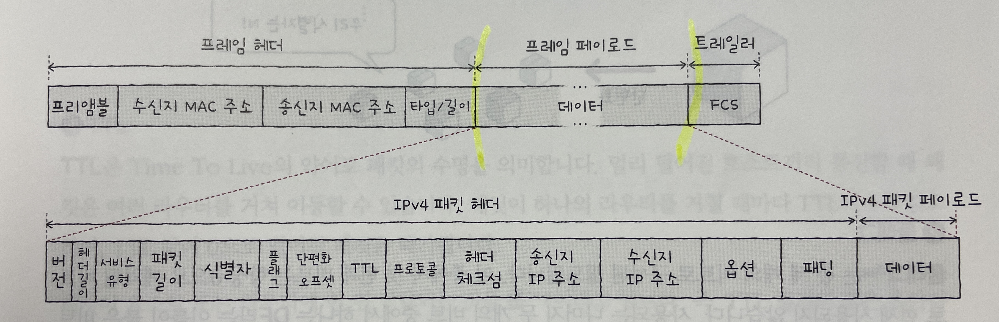
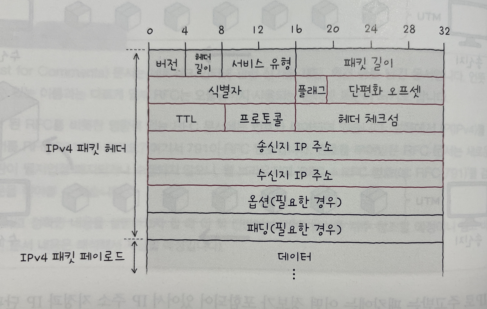
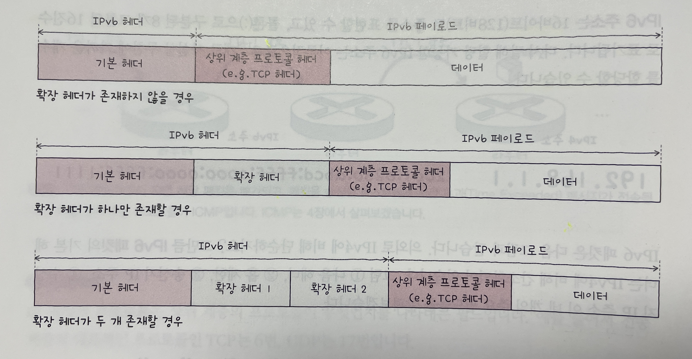
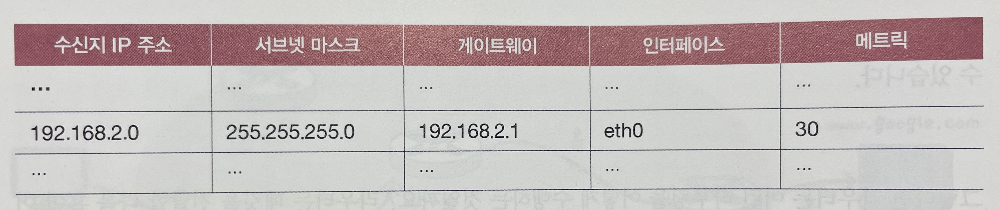
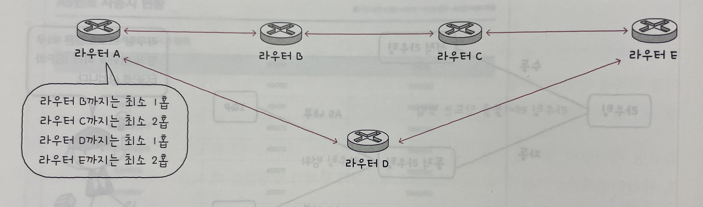
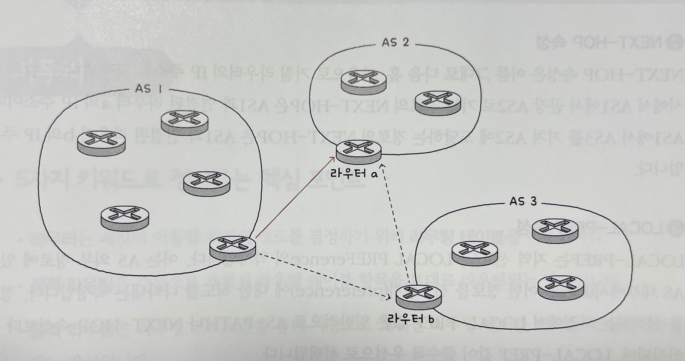

## 2-1 (네트워크 계층)

- 네트워크 계층 : LAN을 넘어서 다른 네트워크와 통신하기 위한 계층
- **IP 주소**로 송수신지 대상을 지정
- **라우팅**을 통해 다른 네트워크에 이르는 경로를 설정

### 데이터 링크 계층의 한계

- 물리 계층과 데이터 링크 계층만으로 네트워크 간 통신하기 어려운 이유 2가지
  1. 다른 네트워크까지의 도달 경로를 파악하기 어려움
  - 물리 계층과 데이터 링크 계층의 네트워크 장비로는 패킷이 이동할 최적의 경로를 결정하는게 어려움 (라우팅이 어려움)
  - 네트워크 계층의 장비로는 가능함. (라우터)
  2. MAC 주소만으로는 모든 네트워크에 속한 호스트의 위치를 특정하기 어려움
  - MAC 주소 테이블을 통해 같은 LAN에 속한 호스트의 MAC 주소를 알 수 있지만, 다른 네트워크의 호스트의 MAC 주소를 알기 어려움
  - 네트워크 계층의 IP 주소를 사용하면 다른 네트워크에 속한 호스트의 위치를 특정할 수 있음
  - 택배로 비유하면, MAC 주소는 택배를 받는 수신인, IP 주소는 택배를 받는 수신지 역할을 함.
    - 수신인(MAC 주소)만으로는 택배를 보낼 수 없고, 수신지(IP 주소)가 필요함

### 인터넷 프로토콜 (IP)

- 네트워크 계층의 가장 핵심적인 프로토콜
- 2가지 버전이 있음 (IPv4, IPv6)
- IP주소라고 하면 일반적으로 IPv4를 의미함.
- IP 주소 형태
  - 4바이트(32비트)로 표현
  - 1바이트(8비트)씩 4개로 나눠서 표현
  - 각 바이트는 10진수로 표현
    - 8비트니까, 0~255까지의 정수로 표현 가능
  - 각 바이트는 `.`으로 구분
  - ex) 192.168.1.1
- IP의 기능 (크게 2가지)
  - IP 주소 지정
    - IP 주소를 바탕으로 송수신 대상을 지정하는 것 (수신지 지정)
  - IP 단편화
    - 전송하고자하는 패킷을 MTU 크기 이하의 패킷으로 나누는 것을 의미
      - MTU(Maximum Transmission Unit)
        - 한 번에 전송할 수 있는 패킷의 최대 크기를 의미
        - IP 패킷의 헤더도 MTU에 포함됨
        - 최대 크기는 1500바이트
    - 나눠진 패킷은 수신지에 도착하면 재조합됨

#### IPv4

- 데이터 링크 계층의 PDU인 프레임의 데이터 필드에는 상위 계층에서 전달받은 내용이 명시됨.
- 즉, 프레임의 데이터 필드에 IP패킷이 명시됨

  

- IP 패킷의 구조 (32비트 기준)

  

  - 식별자, 플래그, 단편화 오프셋 : IP 단편화 기능에 관여
  - 송신지 IP 주소, 수신지 IP 주소 : IP 주소 지정 기능에 관여

1. 식별자

- IP 패킷이 단편화되었을 때, 같은 패킷임을 식별하기 위한 값
- A라는 IP 패킷을 단편화 하여 송신할 때, 수신지에서 식별자를 통해 수신한 패킷이 A임을 알 수 있음

2. 플래그

- 단편화에 관한 정보를 담고 있음
- 3개의 비트로 구성됨
  - 첫번째 비트
    - 사용안함
  - 두번째 비트
    - DF(Don't Fragment)라 함
      - 1로 설정되어 있으면, IP 단편화 금지
      - 0으로 설정되어 있으면, IP 단편화 허용
  - 세번째 비트
    - MF(More Fragment)라 함
      - 1로 설정되어 있으면, 뒤에 더 많은 패킷이 있다는 것을 의미
      - 0으로 설정되어 있으면, 더 이상 패킷이 없다는 것을 의미

3. 단편화 오프셋

- 패킷의 초기 데이터에서 몇 번째로 떨어진 패킷인지를 나타냄
  - 즉 순서를 나타냄
- 수신지에서는 단편화된 패킷을 재조합할 때, 단편화 오프셋을 통해 순서대로 재조합 가능

4. TTL (Time To Live)

- 패킷이 네트워크 상에서 얼마나 오래 살아있을 수 있는지를 나타냄. 즉, 패킷의 수명을 의미
- 패킷이 하나의 라우터를 거칠 때마다 TTL을 1씩 감소시키고, TTL이 0이 되면 해당 패킷은 폐기됨
- TTL의 목적
  - 무의미한 패킷이 네트워크상에 지속적으로 남아있는 것을 방지하는 것
- Hop / 홉
  - 패킷이 호스트나 라움터에 한 번 전달되는 것을 **홉**이라함.

5. 프로토콜

- 상위 계층의 프로토코를 나타냄
  - 예시) 전송 계층의 대표적인 프로토콜인 TCP와 UDP는 각각 6, 17로 표현됨

6. 송신지 IP 주소와 수신지 IP 주소

- 송신지, 수신지의 IP 주소를 나타냄

#### IPv6

- IPv4의 주소는 최대 2^32개의 주소를 가질 수 있음
- IPv4의 주소가 고갈되는 문제를 해결하기 위해 IPv6가 등장
- 아직까지는 IPv4가 주로 사용되지만, IPv6가 점차 사용되고 있음.
- 특징

  - 16바이트(128비트)로 주소 표현 -> 최대 2^128개의 주소를 가질 수 있음
  - 16비트씩 8개 그룹으로 나눠서 표현
  - 각 그룹은 16진수로 표기
  - 예시) 2001:0db8:85a3:0000:0000:8a2e:0370:7334

- IPv6 패킷 구조
  

1. 다음 헤더

- 다음 헤더는 상위 계층의 프로토콜을 가리키거나 확장 헤더를 가리킴
- 확장 헤더

  - IPv6 패킷의 헤더에 추가적인 정보를 담음
  - 기본 헤더와 페이로드 데이터 사이에 위치

    

  - 예시)
    - 홉 간 옵션 확장 헤더
      - 송신지에서 수신지에 이르는 모든 경로의 네트워크 장비에서 패킷을 검사하도록하는 확장 헤더
    - 수신지 옵션 확장 헤더
      - 수신지에서만 패킷을 검사하도록 하는 확장 헤더
    - 라우팅 확장 헤더
      - 라우팅 관련 정보를 운반하는 확장 헤더
    - 단편화 확장 헤더
      - 단편화를 위한 확장 헤더
    - ...

2. 홉 제한

- IPv4의 TTL과 같은 역할. 즉, 패킷의 수명을 나타내는 필드

3. 송신지 IP 주소와 수신지 IP 주소

- IPv4와 동일. 송신지, 수신지의 IP 주소를 나타냄

### ARP

- IP 주소는 알지만 MAC 주소를 모를 때 사용하는 프로토콜
- IP 주소를 통해 MAC 주소를 알아낼 수 있음.
- ARP 동작 과정

  - 상황 : 동일 네트워크의 호스트 A, B가 있음. A가 B에게 패킷을 보내려함. A는 B의 IP 주소는 알지만, B의 MAC 주소는 모르는 상태.

  1. ARP 요청

  - A는 네트워크 내 모든 호스트에게 브로드캐스트 메시지를 보냄
  - 이 메시지는 **ARP 요청**이라는 ARP 패킷.
  - ARP 요청은 '10.0.0.2와 통신하고 싶은데, 이 호스트의 MAC 주소가 뭔지 알려줘'라고 요청하는 것

  2. ARP 응답

  - 네트워크 내의 모든 호스트가 ARP 요청 메시지를 수신하지만, B를 제외한 나머지 호스트는 자신의 IP 주소가 아니므로 요청을 무시함
  - B는 자신의 MAC 주소를 포함한 **ARP 응답**이라는 ARP 패킷을 A에게 보냄 -> 이 패킷은 브로드캐스트가 아닌 유니캐스트로 전송됨 -> B가 A의 IP주소와 MAC주소를 알아야하는것 아닌가? 확인해봐야함.
  - A는 비로소 B의 MAC 주소를 알게 됨.

  3. ARP 테이블 갱신

  - A는 B의 MAC 주소를 알게 되면, 이를 ARP 테이블에 저장함.
  - ARP 테이블은 IP 주소와 MAC 주소의 대응 관계를 저장하는 테이블
  - ARP 테이블에 B의 MAC 주소를 저장하면, 이후에 B에게 패킷을 보낼 때 브로드캐스트로 ARP 요청을 날리지 않아도 됨
  - ARP 테이블은 일정 시간이 지나면 삭제되고, 임의로 삭제할 수도 있음.

  - 상황 : 서로 다른 네트워크의 호스트 A, B가 있음.
  - 구조 : A - 라우터 A - 라우터 B - B

  1. A가 라우터 A의 MAC 주소를 모른다면, ARP 요청 - ARP 응답 과정으로 라우터 A의 MAC 주소를 얻어 와서 라우터 A로 패킷을 전송
  2. 라우터 A가 라우터 B의 MAC 주소를 모른다면, ARP 요청 - ARP 응답 과정으로 라우터 B의 MAC 주소를 얻어 와서 라우터 B로 패킷을 전송
  3. 라우터 B가 B의 MAC 주소를 모른다면, ARP 요청 - ARP 응답 과정으로 B의 MAC 주소를 얻어 와서 B로 패킷을 전송
  4. B가 A에게 응답을 보낼 때, B는 A의 MAC 주소를 알고 있으므로 바로 응답을 보낼 수 있음.

## 2-2 (IP 주소)

- IP 주소는 수신지 역할을 함
- IP 주소는 크게 네트워크 주소와 호스트 주소로 이루어짐

### 네트워크 주소와 호스트 주소

- IP 주소는 네트워크 주소와 호스트 주소로 나뉨
- 경우의 수 (3가지 - IP 주소는 네개의 옥텟으로 이루어져 있으므로)
  1. 네트워크 주소를 첫번째 옥텟에 할당하고 나머지 옥텟은 호스트 주소로 할당하는 경우
  2. 네트워크 주소를 두개의 옥텟에 할당하고, 나머지 두개의 옥텟은 호스트 주소로 할당하는 경우
  3. 네트워크 주소를 세개의 옥텟에 할당하고, 나머지 한개의 옥텟에 호스트 주소를 할당하는 경우
- 1번의 경우 호스트 주소 공간이 너무 커서 다수의 IP 주소가 낭비될 수 있음
- 3번의 경우 사용할 IP 주소가 부족해질 수 있음
- IP 주소를 어떻게 구성해야할지에 대한 고민을 해결하기 위해 생겨난 개념이 IP 주소 클래스

### 클래스풀 주소 체계

- 클래스
  - 네트워크 크기에 따라 IP 주소를 분류하는 기준
  - 필요한 호스트 IP 개수에 따라 네트워크 크기를 가변적으로 조정해 네트워크 주소와 호스트 주소를 구획할 수 있음
  - 클래스를 기반으로 IP 주소를 관리하는 주소 체계를 **클래스풀 주소 체계**라고 함
  - 클래스는 A,B,C,D,E로 나뉨.
  - D, E는 각각 멀티캐스트를 위한 클래스, 특수목적으로 예약된 클래스이기 때문에, 실질적으로 사용되는 클래스느 A,B,C 임.
- 클래스 종류
  - A 클래스
    - 첫번째 옥텟이 네트워크 주소, 나머지 세 옥텟이 호스트 주소로 사용
    - 네트워크 주소는 비트 `0`으로 시작
    - 즉, 이론상 2^7개의 네트워크와 2^24개의 호스트 주소를 사용할 수 있음
    - 최솟값 : `0.0.0.0`, 최댓값: `127.255.255.255`
    - 첫 주소가 0~127일 경우 A 클래스로 판단
  - B 클래스
    - 첫번째 두 옥텟이 네트워크 주소, 나머지 두 옥텟이 호스트 주소로 사용
    - 네트워크 주소는 비트 `10`으로 시작
    - 즉, 이론상 2^14개의 네트워크와 2^16개의 호스트 주소를 사용할 수 있음
    - 최솟값 : `128.0.0.0` 최댓값: `191.255.255.255`
    - 첫 주소가 128~191일 경우 B 클래스로 판단
  - C 클래스
    - 첫번째 세 옥텟이 네트워크 주소, 나머지 한 옥텟이 호스트 주소로 사용
    - 네트워크 주소는 비트 `110`으로 시작
    - 즉, 이론상 2^21개의 네트워크와 2^8개의 호스트 주소를 사용할 수 있음
    - 최솟값 : `192.0.0.0` 최댓값: `223.255.255.255`
    - 첫 주소가 192~223일 경우 C 클래스로 판단
- 호스트의 주소 공간을 모두 사용할 수는 없음
  - 호스트 주소가 전부 0인 IP 주소
    - 네트워크 자체를 의미하는 네트워크 주소로 사용됨
  - 호스트 주소가 전부 1인 IP 주소
    - 브로드캐스트 주소로 사용됨
  - 그러므로, 위에서 이론상으로 계산한 호스트 주소 갯수에서 2를 빼야 실제 사용할 수 있는 호스트 주소 갯수가 됨

### 클래스리스 주소 체계

- 클래스풀 주소 체계는 낭비가 심할 수 있음
  - 예를들어, 300명 직원이 사용할 네트워크를 구성하고 싶을때는 B클래스를 쓸 수 밖에 없음
  - 왜냐하면 C클래스는 호스트에게 할당 가능한 IP가 254개 밖에 되지 않기 때문
  - B 클래스는 할당 가능한 IP가 6만개가 넘음.
  - 결과적으로 6만여개의 IP 주소가 낭비됨
- 이러한 낭비를 줄이기 위해 등장한 것이 클래스리스 주소 체계
- 네트워크 주소와 호스트 주소의 경계가 옥텟 단위가 아니라 임의의 위치에 있을 수 있음
- 클래스리스 주소 체계는 네트워크 주소와 호스트 주소를 구분 짓는 수단으로 **서브넷 마스크**를 이용함
- 서브넷 마스크
  - IP 주소상에서 네트워크 주소는 1, 호스트 주소는 0으로 표기한 비트열을 의미
  - 서브넷 마스크를 이용해 클래스를 원하는 크기로 더 잘게 쪼개어 사용하는 것을 **서브넷팅**이라고 함
  - 예시) A, B, C 클래스의 기본 서브넷 마스크
    - A 클래스 : 255.0.0.0 (11111111.00000000.00000000.00000000)
    - B 클래스 : 255.255.0.0 (11111111.11111111.00000000.00000000)
    - C 클래스 : 255.255.255.0 (11111111.11111111.11111111.00000000)

#### 서브네팅: 비트 AND 연산

- 서브넷 마스크를 이용해 네트워크 주소와 호스트 주소를 구분 짓는 방법 -> IP 주소를 서브넷 마스크와 비트 AND 연산을 수행함
- 비트 AND 연산
  - 두 비트열이 주어졌을 때, 두 비트열이 모두 1일 때만 1을 반환하는 연산
  - 예시) 1100 & 1010 = 1000
- 예시)
  - IP 주소 (10진수) : 192.168.129.103
  - 서브넷 마스크 (10진수) : 255.255.255.0
  - IP 주소 (2진수) : 11000000.10101000.10000001.01100111
  - 서브넷 마스크 (2진수) : 11111111.11111111.11111111.00000000
  - 비트 AND 연산 결과 : 11000000.10101000.10000001.00000000
  - 네트워크 주소 : 192.168.219.0
  - 호스트 주소 갯수 : 2^8 - 2 = 254개

#### 서브넷 마스크 표기 : CIDR 표기법

- 서브넷 마스크를 표기하는 방법은 크게 두가지
  - 10진수로 표기하는 방법
    - ex) 255.255.255.0, 255.255.255.252 ...
  - IP 주소/서브넷 마스크상의 1의 개수 (CIDR 표기법)
    - ex) 192.168.219.103/24 (11111111.11111111.11111111.00000000)
- CIDR 표기법 예시
  - CIDR 표기 : 192.168.0.2/25
    - IP 주소 : 11000000.10101000.00000000.00000010
    - 서브넷 마스크 : 11111111.11111111.11111111.10000000
    - 비트 AND 연산 결과 : 11000000.10101000.00000000.00000000
    - 네트워크 주소 : 192.168.0.0
    - 호스트 주소 갯수 : 2^7 - 2 = 126개
    - 할당 가능한 호스트 IP 범위 : 192.168.0.1 ~ 192.168.0.126
    - 결론 : 192.168.0.2/25는 총 126개의 호스트를 할당할 수 있는 192.168.0.0이라는 네트워크에 속한 2라는 호스트를 의미

### 공인 IP 주소와 사설 IP 주소

- IP는 고유한 IP 주소가 있고, 고유하지 않은 IP 주소가 있음
- 전자는 공인 IP 주소, 후자를 사설 IP 주소라고 함

#### 공인 IP 주소

- 전 세계에서 고유한 IP 주소임
- 네트워크 간 통신, 가령 인터넷을 이용할 때 사용하는 IP주소가 공인 IP 주소임

#### 사설 IP 주소와 NAT

- 사설 IP 주소
  - 인터넷과 연결되지 않은 사설 네트워크에서 사용하기 위한 IP 주소
  - 사설 IP 전용 주소 대역
    - 10.0.0.0/8 (10.0.0.0 ~ 10.255.255.255)
    - 172.16.0.0/12 (172.16.0.0 ~ 172.31.255.255)
    - 192.168.0.0/16 (192.168.0.0 ~ 192.168.255.255)
  - 사설 IP 주소의 할당 주체는 일반적으로 라우터임
- NAT (Network Address Translation)
  - 사설 IP 주소만으로 인터넷 접속을 비롯한 외부 네트워크 간의 통신이 어려움
  - 이를 해결하기 위해 NAT이라는 기술이 등장함
  - NAT은 사설 IP 주소를 공인 IP 주소로 변환하는 기술
  - 대부분의 라우터와 공유기에는 NAT 기능이 내장되어 있음
  1. 패킷 송신 시
  - 패킷 속 사설 IP 주소는 공유기를 거쳐 공인 IP 주소로 변환되어 외부 네트워크로 전송됨
  2. 패킷 수신 시
  - 패킷 속 공인 IP 주소는 공유기를 거쳐 사설 IP 주소로 변환되어 내부 네트워크 속 호스트로 전송됨

### 정적 IP 주소와 동적 IP 주소

- 호스트에 IP 주소를 할당하는 방법은 크게 두가지
  - 정적 할당과 동적 할당

#### 정적 할당

- 호스트에 직접 수작업으로 IP 주소를 부여하는 방식
- 이렇게 할당된 주소를 **정적 IP 주소**라고 함

#### 동적 할당

- IP 주소를 정적으로만 할당하면 호스트 수가 많아질 경우, 관리가 힘들어짐. 이를 위해 동적 할당이 등장.
- IP 주소를 일일이 입력하지 않고 호스트에 IP 주소를 자동으로 할당하는 방식.
- 이렇게 할당된 주소를 **동적 IP 주소**라고 함
- DHCP
  - IP 동적 할당에 사용되는 대표적인 프로토콜
  - DHCP를 통한 IP 주소 할당
    - IP 주소를 할당받고자 하는 호스트와 해당 호스트에게 IP 주소를 제공하는 DHCP 서버간에 메시지를 주고받음으로써 IP 주소를 할당받음
    - DHCP 서버 역할은 일반적으로 라우터가 수행. 특정 호스트에 DHCP 서버기능을 추가할 수도 있음
    - DHCP 서버는 클라이언트에게 할당 가능한 IP 주소 목록을 관리하고, 클라이언트가 요청하면 이 목록 중 하나를 할당함
    - 할당받은 IP는 사용 기간이 정해져있음. 이 기간이 지나면 IP 주소는 반환됨
  - 클라이언트, DHCP 서버간 메시지 종류 (4가지)
    1. DHCP Discover (클라이언트 -> DHCP 서버)
    - 클라이언트 DHCP 서버를 찾기 위해 브로드캐스트로 DHCP Discover 메시지를 전송함
    - 이때 송신지 IP는 0.0.0.0으로 설정됨 (IP 할당 받기 전이라서)
    2. DHCP Offer (DHCP 서버 -> 클라이언트)
    - DHCP 서버는 DHCP Discover 메시지를 받으면, 클라이언트에게 DHCP Offer 메시지를 유니캐스트로 전송함
    - 이 메시지에는 클라이언트에게 할당 가능한 IP 주소와 서브넷 마스크, 임대 기간등이 포함됨
    - Offer, 말그대로 사용가능한 IP 주소를 제안하는 것
    3. DHCP Request (클라이언트 -> DHCP 서버)
    - 클라이언트는 DHCP Offer 메시지를 받으면, DHCP Request 메시지를 DHCP 서버에게 유니캐스트로 전송함
    - 이 메시지는 클라이언트가 할당받은 IP 주소를 요청하는 것을 의미
    - Request, 말그대로 제안받은 IP 주소를 요청하는 것
    4. DHCP Ack (DHCP 서버 -> 클라이언트)
    - DHCP 서버는 DHCP Request 메시지를 받으면, DHCP Ack 메시지를 클라이언트에게 유니캐스트로 전송함
    - 이 메시지는 클라이언트에게 IP 주소를 할당하는 것을 의미
    - Ack(Acknowledgement), 말그대로 요청받은 IP 주소를 승인하는 것
    - 클라이언트는 DHCP Ack 메시지를 받으면, 임대 기간동안 할당받은 IP 주소를 사용함

## 2-3 (라우팅)

- 라우터의 핵심기능인 라우팅에 대해 알아보자
- 패킷이 이동할 최적의 경로를 설정한 뒤, 해당 경로로 패킷을 이동시키는 것을 라우팅이라 함

### 라우터

- 네트워크 계층의 핵심 기능을 담당하는 장비
- 로컬에서 구글웹페이지를 확인할 때,
  - 내 로컬과 구글 서버 사이에 수많은 라우터들이 있음
  - 패킷은 여러 홉을 거쳐 라우팅 되어 최종적으로 구글 웹 사이트를 보게 됨.
    - 홉 : 패킷이 라우터에서 라우터로 이동하는 것

### 라우팅 테이블

- 라우터는 라우팅 테이블을 참고하여 수신지까지의 도달 경로를 판단함.
- 라우팅 테이블
  - 특정 수신지까지 도달하기 위한 정보를 명시한 테이블
  - 다음과 같은 정보를 포함
  1. 수신지 IP 주소와 서브넷 마스크
  - 최종적으로 패킷을 전달할 대상
  2. 다음 홉
  - 다음으로 패킷을 전달할 호스트의 IP 주소나 인터페이스를 의미
  - 게이트웨이라고 명시하기도 함
  3. 네트워크 인터페이스
  - 패킷을 내보낼 통로를 의미
  - 인터페이스 이름 명시 or 인터페이스의 IP 주소 명시
  4. 메트릭
  - 해당 경로로 이동하는데 드는 비용을 의미
  - 라우터가 패킷을 내보낼 때, 라우팅 테이블에 있는 경로 중 메트릭이 낮은 경로를 선호하게 됨
- 라우팅 테이블 예시

  

  - 위와 같이 라우팅 테이블이 구성되어 있다면,
  - 수신지가 192.168.2.0/24인 패킷은 eth0 인터페이스를 통해 192.168.2.1 게이트웨이로 전송하라는 것을 의미함
  - 수신지가 라우팅 테이블에 없다면, 라우터로 패킷을 전송함

### 정적 라우팅과 동적 라우팅

- 라우팅 테이블을 구성하는 방법은 크게 두가지
  - 정적 라우팅과 동적 라우팅

#### 정적 라우팅

- 사용자가 수동으로 직접 채워 넣은 라우팅 테이블을 통해 라우팅되는 방식

#### 동적 라우팅

- 라우터끼리 라우팅 정보를 교환하여 라우팅 테이블을 자동으로 업데이트하는 방식
- 이때 사용하는 프로토콜이 **라우팅 프로토콜**

### 라우팅 프로토콜

- 라우터끼리 자신들의 정보를 교환하며 패킷이 이동할 최적의 경로를 찾기 위한 프로토콜
- 라우팅 프로토콜은 2가지로 나뉨
  - AS 내부에서 수행 : IGP (Interior Gateway Protocol)
  - AS 외부에서 수행 : EGP (Exterior Gateway Protocol)
- AS(Autonomous System)란?
  - 동일한 라우팅 정책으로 운용되는 라우터들의 집단
  - 한 회사나 단체에서 관리하는 라우터 집단을 AS라 생각하면 됨.

#### IGP : RIP와 OSPF

- 대표적인 IGP로는 RIP(Routing Information Protocol)와 OSPF(Open Shortest Path First)가 있음.
- RIP

  - 거리 벡터 기반 라우팅 프로토콜
  - 말그대로 거리를 기반으로 최적의 경로를 찾는 라우팅 프로토콜임
  - 이때 거리는 라우터와 목적지 사이의 홉 수를 의미
  - 홉 수가 적을수록 라우팅 테이블상의 메트릭 수도 작아짐

  

- OSPF
  - 링크 상태 기반 라우팅 프로토콜
  - 네트워크는 노드와 간선(링크)로 이루어짐
  - 링크 상태와 네트워크의 상태를 그래프 형태로 **링크 상태 데이터베이스**에 저장함
  - 링크 상태 데이터베이스의 정보를 통해 그래프의 최단 경로를 찾아내는 방식으로 라우팅을 수행함
  - OSPF는 대역폭을 기반으로 메트릭을 계산
    - 대역폭이 높은 링크일수록 메트릭이 낮은 경로로 인식
  - 정보를 주기적으로 교환하는 RIP와 달리, 네트워크 구성이 변경되었을때 라우팅 테이블을 갱신
    - 네트워크 규모가 커지면 링크 상태 데이터베이스에 모든 정보를 저장하기 어려워짐
      - AS를 **에어리어**(area)라는 단위로 나누고, 각 에어리어마다 링크 상태 데이터베이스를 구성함
      - 에어리어 경계에 있는 **ABR**(Area Border Router)가 각 에어리어간의 연결을 함

#### EGP : BGP (Border Gateway Protocol)

- AS 간 통신이 가능한 프로토콜
- 2가지 BGP
  - AS 간의 통신 - eBGP
  - AS 내의 통신 - iBGP
- AS 간 연결
  - AS 간 정보를 주고 받기 위해서 AS 내에서 eBGP를 사용하는 라우터가 하나 이상 있어야함
  - 각 AS의 BGP 끼리 연결됨으로써 AS간의 통신이 가능해짐.
  - BGP 간의 연결은 BGP 메시지를 주고받음으로써 이루어지고, 이러한 BGP들의 연결을 **피어**라고 함
- BGP의 속성

  - BGP는 수신지와 더불어 속성을 함께 고려하여 최적의 경로를 결정. 아래는 BGP의 속성 중 대표적인 3가지

  1. AS-PATH

  - 메시지가 수신지에 이르는 과정에서 통과하는 AS들의 목록을 나타냄
  - 아래 그림에서 AS1에서 AS2로 메시지를 보낼 때, 두가지 경로가 있음
  - 하나는, AS1 -> AS2로 바로 보내는 것. 이때 AS-PATH는 `AS2`
  - 다른 하나는, AS1 -> AS3 -> AS2로 보내는 것. 이때 AS-PATH는 `AS3 AS2`

    

  - 여기서 알 수 있는 BGP 특징 2가지
    1. BGP는 라우팅할 때, 라우터 수가 아닌 `AS 수`를 고려함
    - AS-PATH가 짧은 경로일지라도, 홉 수가 더 많을 수 있음
    2. BGP는 라우팅할 때, 최단 경로를 찾는 것이 아닌, AS-PATH가 가장 짧은 경로를 찾음. 즉 거리가 아닌, 어디를 거쳐 어디로 이동하는지를 나타내는 `경로`를 고려함

  2. NEXT-HOP

  - 다음으로 거칠 라우터의 IP 주소를 나타냄
  - 위의 그림에서 다시 예로 들면,
    - AS1 -> AS2로 바로 보내는 경우, NEXT-HOP는 `a의 IP 주소`
    - AS1 -> AS3 -> AS2로 보내는 경우, NEXT-HOP은 `b의 IP 주소`

  3. LOCAL-PREF

  - LOCAL PREFerence의 약자로, 지역 선호도를 의미함.
  - AS 내부의 라우터끼리 경로 설정 시에, 정책적으로 특정 경로에 우선순위를 두는 것을 의미함
  - AS 내부에서의 정책이기 때문에, iBGP에서 사용됨
